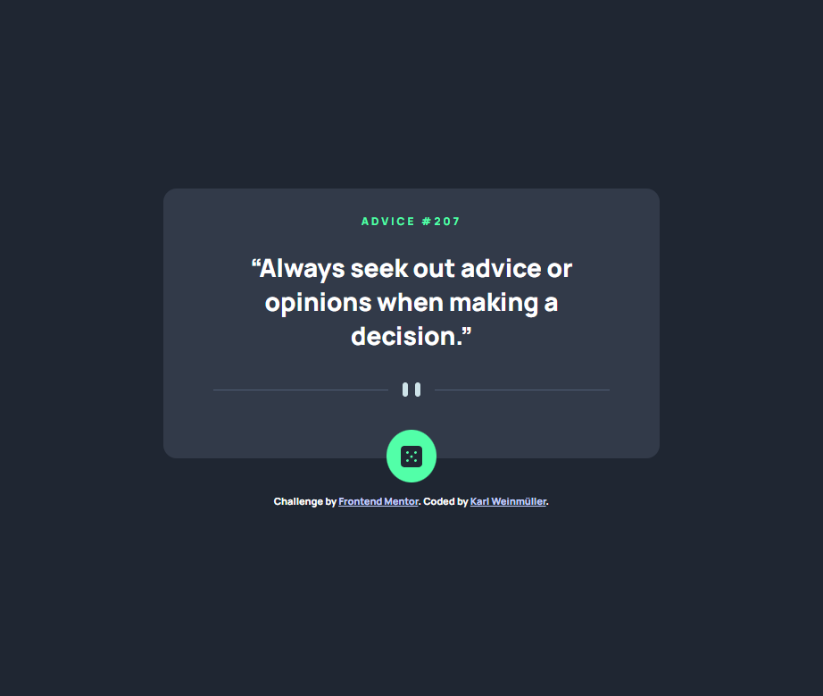
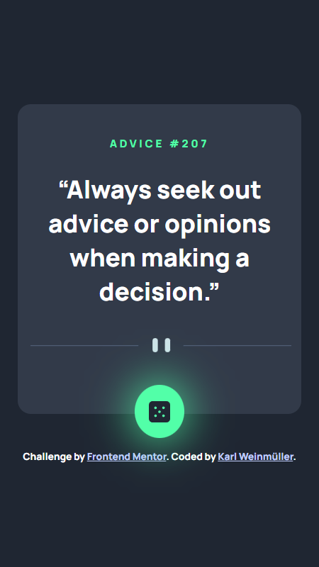

# Frontend Mentor - Advice generator app solution

This is a solution to the [Advice generator app challenge on Frontend Mentor](https://www.frontendmentor.io/challenges/advice-generator-app-QdUG-13db). Frontend Mentor challenges help you improve your coding skills by building realistic projects.

## Table of contents

- [Overview](#overview)
  - [The challenge](#the-challenge)
  - [Screenshot](#screenshot)
  - [Links](#links)
- [My process](#my-process)
  - [Built with](#built-with)
  - [Useful resources](#useful-resources)
- [Author](#author)

## Overview

### Screenshot

### Links

- Solution URL: [Github](https://your-solution-url.com)
- Live Site URL: [Live-Site](https://advice-generator-app-ashy.vercel.app/)

## My process

### Built with

- Semantic HTML5 markup
- Flexbox
- [Svelte](https://svelte.dev/) - JS library

### Useful resources

- [Svelte Documentation](https://svelte.dev) - This helped me to fetch the data from API.

## Author

- Website - [Karl Weinmueller](https://www.karlweinmueller.de)
- Frontend Mentor - [@Karl-afk](https://www.frontendmentor.io/profile/Karl-afk)
